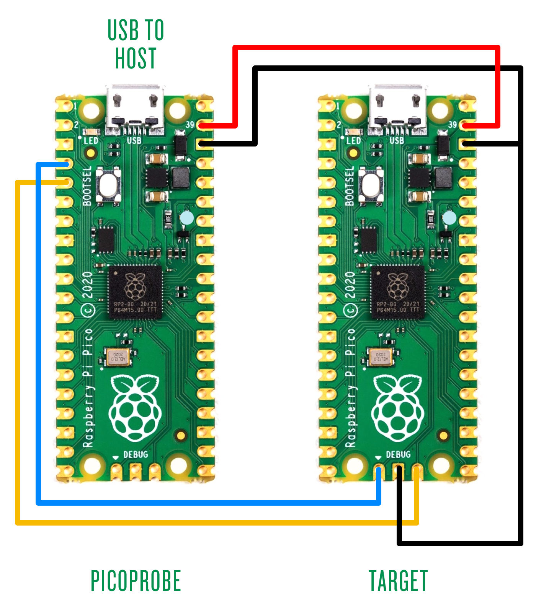

macOS SDK
=========

https://datasheets.raspberrypi.org/pico/getting-started-with-pico.pdf

Pre-requisites
--------------

1.	[The Missing Package Manager for macOS (or Linux) — Homebrew](https://brew.sh/)

Get SDK and examples
--------------------

```shell
mkdir -p ~/projects/pico
cd ~/projects/pico
git clone --recurse-submodules https://github.com/raspberrypi/pico-sdk.git
git clone https://github.com/raspberrypi/pico-examples.git
```

### Optional: Get pico-extras and pico-playground

```shell
cd ~/projects/pico
git clone https://github.com/raspberrypi/pico-extras.git
git clone https://github.com/raspberrypi/pico-playground.git
```

Install the toolchain
---------------------

```shell
brew install cmake
brew tap ArmMbed/homebrew-formulae
brew install arm-none-eabi-gcc
```

Download and install [Visual Studio Code](https://code.visualstudio.com/download)

Blink an LED
------------

```shell
cd ~/projects/pico/pico-examples
mkdir build
cd build
export PICO_SDK_PATH=../../pico-sdk

cmake \
  -DCMAKE_BUILD_TYPE=Debug \
  -DCMAKE_EXPORT_COMPILE_COMMANDS=ON ..

# cmake --build . --target blink --parallel 7
cd blink
make -j5
# will produce `blink.elf` and `blink.uf2`

#
cd ~/projects/pico/pico-examples/blink/
# edit blink.c

#
cd ~/projects/pico/pico-examples/build/blink
make -j5


```

Install OpenOCD (for `picoprobe`\)
----------------------------------

-	`--disable-presto --disable-openjtag` added to `configure` based on
	-	[Fails to compile on MacOS using the latest libftdi · Issue #7 · raspberrypi/openocd](https://github.com/raspberrypi/openocd/issues/7#issuecomment-766730331)

```shell
brew install open-ocd --only-dependencies
brew install automake
brew install autoconf pkg-config libtool texinfo wget gcc

cd ~/projects/pico
git clone https://github.com/raspberrypi/openocd.git --branch picoprobe --depth=1 --no-single-branch
cd openocd

export PATH="/opt/homebrew/opt/texinfo/bin:/usr/local/opt/texinfo/bin:$PATH"
./bootstrap
CAPSTONE_CFLAGS="-I/opt/homebrew/Cellar/capstone/4.0.2/include/capstone -I/opt/homebrew/include" \
  ./configure --prefix=/opt/homebrew  \
  --enable-picoprobe --disable-presto --disable-openjtag

src/openocd
```

### picoprobe

```shell
cd ~/projects/pico
git clone https://github.com/raspberrypi/picoprobe.git
cd picoprobe
mkdir build
cd build
echo $PICO_SDK_PATH
cmake ..
make -j5
# produces picoprobe.elf/picoprobe.uf2
```

`picoprobe` installs onto Pico like any other application.

#### Picoprobe Wiring



Image copied from: [How to debug a Raspberry Pi Pico with a Mac, SWD and… another Pico | smittytone messes with micros](https://blog.smittytone.net/2021/02/05/how-to-debug-a-raspberry-pi-pico-with-a-mac-swd/)

### minicom

```shell
brew install minicom
ls -latr /dev/tty.usb*
minicom --baudrate 115200 --noinit --device /dev/tty.usbmodem224201
minicom --baudrate 115200 --noinit --device /dev/tty.usbmodem0000000000001
```

-	To exit minicom, use <kbd>Esc-z</kbd> followed by <kbd>x</kbd>.

###

```shell
cd ~/projects/pico/openocd
src/openocd -f interface/picoprobe.cfg -f target/rp2040.cfg -s tcl
```

Picotool
--------

from "Appendix B: Using Picotool"

```shell
cd ~/projects/pico
git clone https://github.com/raspberrypi/picotool.git
cd picotool

brew install libusb pkg-config
```

building

```shell
cd ~/projects/pico/picotool
mkdir build
cd build
echo $PICO_SDK_PATH
# export PICO_SDK_PATH=$HOME/projects/pico/pico-sdk
cmake ../
make
./picotool help
# Pico in BOOTSEL mode
./picotool info
./picotool info -a
```

can be used to inspect and manage local files

```shell
cd ~/projects/pico/picotool/build
./picotool info -a ~/projects/pico/pico-examples/build/blink/blink.uf2
./picotool info --pins ~/projects/pico/pico-examples/build/blink/blink.elf
```

can load a program

```shell
cd ~/projects/pico/picotool/build
./picotool info -a
# load and e(x)ecute a program
./picotool load -x ~/projects/pico/pico-examples/build/blink/blink.uf2
```

can reboot a pico

```shell
cd ~/projects/pico/picotool/build
./picotool info -a
# Reboot back into the (a)pplication
./picotool reboot --application
# Reboot back into BOOTSEL mode
./picotool reboot --usb
```

Automatic project creation
--------------------------

```shell
cd ~/projects/pico
git clone https://github.com/raspberrypi/pico-project-generator.git
cd pico-project-generator
./pico_project.py --gui
```

```shell
cd ~/projects/pico/pico-first-projects/projects
~/projects/pico/pico-project-generator/pico_project.py \
  --feature spi --feature i2c --project vscode test
cd test/build
cmake -DCMAKE_BUILD_TYPE=Debug \
      -DCMAKE_EXPORT_COMPILE_COMMANDS=ON \
      ..


```
